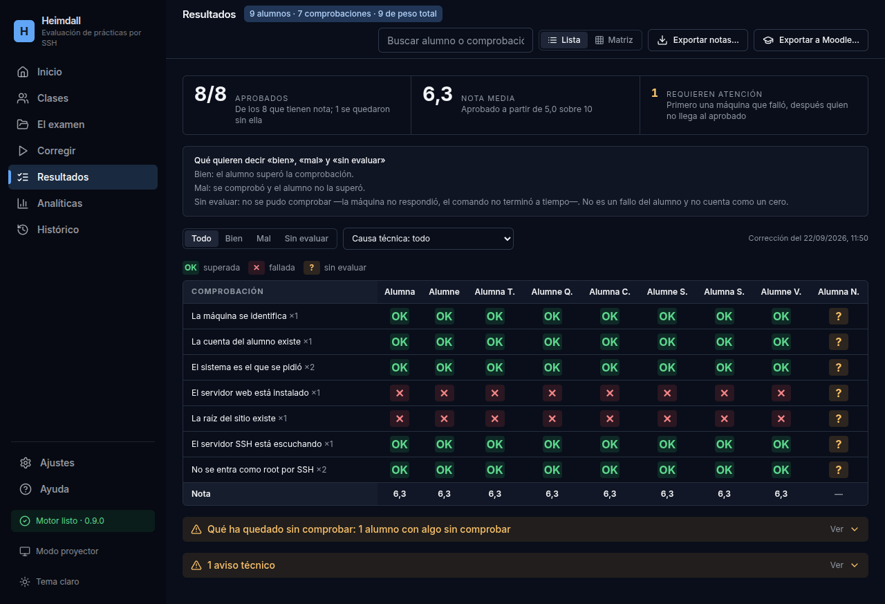

<p align="center">
  
</p>

<h1 align="center">Heimdall</h1>

<p align="center">
  <strong>Comprueba por SSH, en muchas máquinas a la vez, que la infraestructura es la que se pidió.</strong><br>
  Una definición en YAML, un binario, un informe en JSON.
</p>

<p align="center">
  
  
  
</p>

---

Heimdall corrige prácticas de sistemas y redes: entra por SSH en la máquina de
cada alumno, comprueba que los servicios, la configuración y la red están como
se pidió, y pone la nota.

```
examen.yaml + la clase  →  Heimdall  →  máquinas del alumnado  →  notas
```

El examen se escribe en YAML, o desde la propia aplicación. Cada comprobación
termina en uno de tres estados —bien, mal o **sin evaluar**—, y esa tercera
casilla es la razón de ser del proyecto: una máquina apagada no es un trabajo
mal hecho.

El nombre viene del guardián de la mitología nórdica, el que vigila sin
descanso.

## Así se ve



La matriz es la clase entera de un vistazo: una fila por comprobación, una
columna por alumno. Al pulsar una celda se ve el comando que se ejecutó, lo
que contestó la máquina y lo que se esperaba.

La última alumna tiene la máquina apagada: sus comprobaciones salen **sin
evaluar**, no suspensas, y se queda sin nota hasta que se pueda repetir. Los
demás no se ven afectados.

<sub>Captura real contra el laboratorio de pruebas (`testdata/portada`), con
nombres ficticios. Todas las máquinas del laboratorio son la misma, de ahí que
las columnas salgan iguales.</sub>

## Lo que no se negocia

1. **Un error técnico nunca es un suspenso.** Una máquina apagada sale *sin
   evaluar*, con el motivo escrito. Nunca un 0.
2. **Si queda algo sin evaluar, no hay nota final**, solo una provisional
   marcada. La nota se publica cuando se puede defender.
3. **Todos los alumnos reciben las mismas comprobaciones y los mismos pesos**,
   y el denominador se fija antes de tocar ninguna máquina.
4. **Ningún alumno puede tumbar la corrección de los demás**, y ningún comando
   puede colgarla.
5. **Los secretos no aparecen** en el informe, ni en los logs, ni en `ps`.

## Estado

**Versión 0.9.1**: la aplicación está completa y empaquetada en `.deb` y
AppImage con el motor dentro. Falta la prueba de fuego —un examen real
corregido de principio a fin— y esa será la 1.0.0.

## Documentación

| Necesitas… | Lee |
|---|---|
| Usarlo para corregir | [docs/GUIA.md](docs/GUIA.md) |
| Qué trae cada versión | [docs/NOTAS-DE-VERSION.md](docs/NOTAS-DE-VERSION.md) |
| Compilarlo, probarlo o escribir un examen | [docs/DESARROLLO.md](docs/DESARROLLO.md) |
| Por qué está montado así | [docs/adr/](docs/adr/) |

## Licencia

El código de este repositorio está bajo la [Mozilla Public License 2.0](LICENSE).

## Contexto

Lo escribe [Adrià Muñoz](https://github.com/adr1mt), profesor de informática en
el Institut El Puig, para corregir los exámenes de servicios en red de SMX. Las
credenciales que aparecen en los tests son ficticias y solo valen dentro de los
contenedores del laboratorio.
